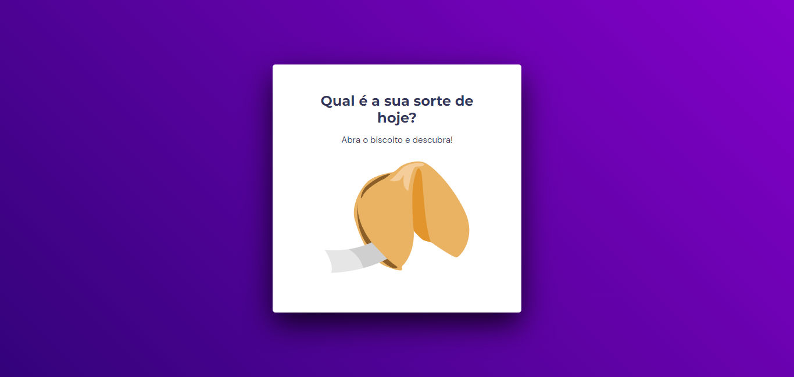

# explorer-biscoito-da-sorte

  

## 🖥️ Projeto
Desafio do stage 5 da rocketseat, para fazer uma aplicação de um biscoito da sorte, você pode dar uma olhada depois que está bastante divertido. Utilizei manipulação da DOM, array, eventos de click e keydown, function e callbacks, além de keyframes no css e outras propriedades muito legais de estilização.

## 🚀 Tecnologias
Foi desenvolvido esse projeto com as seguintes tecnologias:

- HTML
- CSS
- JAVASCRIPT
- FIGMA
- GIT
- GITHUB

## 👀 Ver
Aqui você pode visualizar o layout do projeto:
<a href="https://www.figma.com/file/57WeuQqYSLCmmOjSJVtYPu/Biscoito-da-Sorte-(Community)?node-id=105%3A34&mode=dev">clique aqui</a>

